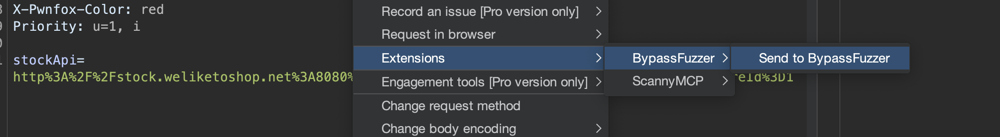
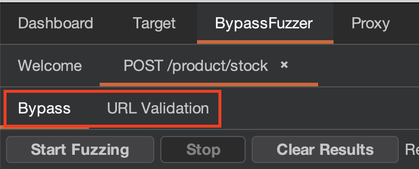

# BypassFuzzer - Burp Suite Extension

A Burp Suite extension for testing authorization bypass vulnerabilities (401/403 bypasses). This is a Java port of the Python [BypassFuzzer](https://github.com/intrudir/BypassFuzzer) tool, fully integrated with Burp Suite.

## Table of Contents

- [Features](#features)
- [Requirements](#requirements)
- [Installation](#installation)
  - [Building from source (optional)](#building-from-source-optional)
- [Usage](#usage)
  - [Basic Workflow](#basic-workflow)
  - [Sweep Tab](#sweep-tab)
  - [Bypass Tab](#bypass-tab)
  - [URL Validation tab](#url-validation-tab)
  - [Smoke Testing](#smoke-testing)
- [Vulnerable Lab](#vulnerable-lab)
- [Documentation](#documentation)
- [Custom Payloads](#custom-payloads)
- [License](#license)
- [Credits](#credits)

## Features
BypassFuzzer has four main testing areas:

- **Sweep** for broad, bounded coverage of in-scope Proxy-history responses such as `401` and `403`.
- **Bypass** for targeted authorization bypass testing against a request you send to BypassFuzzer.
- **IDOR** for object identifier and BOLA-style request mutation.
- **URL Validation** for marker-driven URL validation and SSRF-style allow-list bypass testing.

- **Sweep Mode:**
  - Available immediately when the extension loads
  - Pulls in-scope Proxy history by response status, defaulting to `401` and `403`
  - Deduplicates endpoint shapes before sending probes
  - Uses a bounded, mile-wide/inch-deep probe set with a default cap of 30 probes per endpoint
  - Includes a preview table and exact probe preview before sending requests
  - Uses an explicit build-time wordlist at `src/main/resources/payloads/sweep_probes.txt`
  - Shows concrete signals such as `403 -> 200` and suppresses noisy `4xx` probe signals

- **AuthZ Bypass Attack Types:**
  - Header-based attacks (283+ bypass headers)
  - Path manipulation (367+ URL encodings)
  - HTTP verb/method attacks (11 methods + overrides + case variations + X-prefix/suffix)
  - Debug parameter injection (31 common debug params with case variations)
  - Cookie debug parameter injection (same params as cookies + fuzz existing cookie values)
  - Trailing dot attack (absolute domain notation)
  - Trailing slash attack (tests with/without trailing slash and /. pattern)
  - Extension attack (75+ file extensions like .json, .html, .php)
  - Content-Type attack (converts between URL-encoded, JSON, XML, multipart/form-data)
  - Encoding attack (URL, double-URL, triple-URL, unicode, unicode-overflow encoding on paths, parameter names, and parameter values in query strings and all body content types)
  - HTTP protocol attacks (e.g. HTTP/1.0, HTTP/0.9)
  - Case variation attack (random capitalizations with smart limits)
- **Dedicated URL Validation Tab:**
  - URL Validation playbooks based on the [Portswigger Cheatsheet](https://portswigger.net/web-security/ssrf/url-validation-bypass-cheat-sheet)
  - Mark your injection points with `{INJECT}`
  - Includes a `View Payloads` preview for the exact generated list before execution
- **Smart Filtering:** Automatically reduces noise by hiding repeated responses with pattern tracking
- **Rate Limiting & Auto-Throttling:**
  - Configurable requests per second (default: unlimited)
  - Auto-throttle when rate limit errors detected (429, 503)
  - Automatically reduces speed by 50% when throttled
- **Collaborator Integration:** Dynamic Burp Collaborator payload generation to watch for out-of-band interactions (Burp Professional only)
- **Smoke Testing:**
  - Local vulnerable lab under `src/test/vulnerable_lab`

## Requirements

- Java 17 or higher
- Burp Suite Professional or Community Edition (2023.10+)
- Gradle 7.0+ (for building)

## Installation
1. Download latest JAR from the [releases page](https://github.com/intrudir/BypassFuzzer-Burp/releases)
2. In Burp, go to **Extensions** → **Installed**
3. Click **Add**
4. Select **Extension file**: `bypassfuzzer.jar`
5. The extension will load and a "BypassFuzzer" tab will appear

### Building from source (optional)

```bash
# Build the extension JAR
./gradlew clean shadowJar

# The compiled JAR will be at:
# build/libs/bypassfuzzer.jar
```

Builds embed the public S3 version manifest URL by default so BypassFuzzer can notify users when a newer release is available. Override it for custom release channels with `-PupdateManifestUrl=...`.

# Usage

## Basic Workflow

1. **Send Request to BypassFuzzer:**
   - In Proxy, Sitemap, or Repeater, find any 403/401, any suspiciously blocked request
   - Right-click request 
   - Select "Send to BypassFuzzer"

2. **Choose Attack Mode:**
   - `Sweep` for broad coverage of blocked endpoints found in Proxy history
   - `Bypass` for the core AuthZ bypass playbooks
   - `IDOR` for object identifier and BOLA-style mutations
   - `URL Validation` for marker-driven URL validation testing


### Sweep Tab

The `Sweep` tab is available as soon as the extension loads. It is intended for broad, bounded coverage when you want to check many blocked endpoints without running the full Bypass playbooks against every request.

**Workflow**

1. Select which Proxy history responses to load:
   - `401` and `403` are selected by default
   - `3xx` and `4xx` can be included when you intentionally want broader coverage
2. Click **Load from Proxy History**
3. Review the deduped candidate table
4. Uncheck candidates you do not want to probe
5. Use **Preview Probes** to inspect the exact requests that will be sent for a selected candidate
6. Click **Start Sweep**

**What Sweep sends**

Sweep does not run the full BypassFuzzer payload inventory. It uses a curated wordlist capped at 30 probes per endpoint by default. The bundled wordlist focuses on:

- matrix and extension normalization such as `;.json`, `;.html`, `.json;`, and `.html;`
- trailing slash and dot-segment normalization
- double and triple slash variants
- segment-level case variants such as `/ADMIN/users` and `/admin/USERS`
- deterministic mixed-case variants
- selected URL-encoded path-character variants
- selected debug parameters such as `debug=true`, `debug=1`, `test=true`, and `admin=true`
- selected lightweight header probes such as `X-Forwarded-For` and placeholder `Authorization` values

Sweep results show all responses. The `Signal` column is reserved for concrete interesting changes, such as:

- `403 -> 200`
- `401 -> 302`
- `Content-Type text/html -> application/json`
- `Length +347`

Probe responses with `4xx` status codes are still shown, but they are not marked with a signal.

### Bypass Tab

**Configure the attack**

1) Select attack types to enable (or use Check All/Uncheck All)

2) Optionally:
   - Enable Collaborator payloads (Burp Professional only)
   - Configure rate limiting:
   - Set requests/second (0 = unlimited, default)
   - Configure auto-throttle status codes (default: 429, 503)

3) Manual & Smart filter
   - manual filter lets you choose various options to find what you want
   - smart filter auto mutes uninteresting responses for you

4) Results table, sortable columns

5) Inspect a result's request & response
     
**Start Fuzzing**
   - Click the **Start Fuzzing** button
   - Results appear in real-time, filtered with your criteria in real-time
   - Can stop fuzzing at any time with the `Stop` button
   - Auto-throttle will activate if rate limit errors detected
   - Can right click a request to color it for identification/filtering later

**Scan History:**
   - Export results to CSV/JSON (TODO)

### URL Validation tab
**Configure the attack**

1) Configure Attack button opens configuration window

2) {INJECT} marker is where all your pyloads get shoved into, in the request

3) Add your "allow listed" host and your attacker controlled domain (or SSRF target). The tool will try different variations of bypasses ot trick the URL validation with these values.

4) Advanced options that should work exactly like the Portswigger cheatsheet. 
- Different payload families: playbooks for when you're attacking a CORS/origin header, attacking just a hostname, or if you wanna use full URLs + schemas.
- Additonal payload options
- Encoding options (I recommend Intruder's by default)

5) Start URL validation button - will close the config window for you so you can see the results

## Smoke Testing

```bash
# Unit and regression tests
./gradlew test

# Attack-driven smoke suite
./gradlew smokeTestPlaybooks
```

The smoke testing suite starts a local vulnerable app automatically and exercises the real attack strategies, payload expansion, registry wiring, shared executor flow, and URL Validation workflow without requiring Burp.

--- 

# Vulnerable Lab

For manual Burp validation and local attack smoke tests, use the vulnerable app in [`src/test/vulnerable_lab`](src/test/vulnerable_lab).

Manual run:

```bash
python3 src/test/vulnerable_lab/app.py
```

Then:

Request `GET /login` to receive `session=lab-user`

Run the extension against those requests or execute `./gradlew smokeTestPlaybooks`


Real-world-style examples in the lab include:

- reverse-proxy header trust on `/edge/private/reports/quarterly`, where `X-Forwarded-For`, `X-Custom-IP-Authorization`, `X-Original-URL`, or `X-Rewrite-URL` can incorrectly punch through an edge-protected report route
- nested report and billing routes that return `403` until a path-normalization payload collapses them back to the protected backend path
- a weak Bearer-token admin route on `/api/v2/admin/audit` that returns `403` for a normal user token and is bypassed because token shape is checked more than token validity
- separate consultant-demo routes for method confusion, truthy query parameters, truthy cookies, trailing-dot host routing, content-type parser confusion, and HTTP/1.0 downgrade handling
- the existing URL-validation examples for redirect, host, and CORS trust decisions

The detailed route matrix and black-box lab checks are documented in [`src/test/vulnerable_lab/README.md`](src/test/vulnerable_lab/README.md).

## Documentation

Wiki-style project documentation lives under [`wiki/`](wiki/), including:

- [`wiki/Home.md`](wiki/Home.md)
- [`wiki/Playbooks-Overview.md`](wiki/Playbooks-Overview.md)
- [`wiki/Coverage-Sweep-Mode.md`](wiki/Coverage-Sweep-Mode.md)
- [`wiki/AuthZ-Bypass-Playbooks.md`](wiki/AuthZ-Bypass-Playbooks.md)
- [`wiki/URL-Validation-Playbooks.md`](wiki/URL-Validation-Playbooks.md)
- [`wiki/IDOR-BOLA-Playbooks.md`](wiki/IDOR-BOLA-Playbooks.md)
- [`wiki/Adding-New-Playbooks.md`](wiki/Adding-New-Playbooks.md)

GitHub's Wiki tab is a separate Git repository. In this project, `wiki/` is the source of truth in the main repo, and you can mirror it into the GitHub wiki with:

```bash
./scripts/publish-wiki.sh --push
```

The script clones or updates `../BypassFuzzer-Burp.wiki`, syncs the Markdown pages from `wiki/`, and pushes them to the GitHub wiki repo.

## Custom Payloads

You can edit the payload files before building. UI config for this will be added in a future release.

Sweep uses an explicit build-time probe wordlist:

- `src/main/resources/payloads/sweep_probes.txt`

Each Sweep row is either a `PATH` or `HEADER` template:

```text
PATH|Path Normalization|Uppercase first segment|{PATH_FIRST_SEGMENT_UPPERCASE}
PATH|Debug Params|Append debug=true|{PATH}{QUERY}{QUERY_APPEND_SEPARATOR}debug=true
HEADER|Header|Authorization bearer placeholder|Authorization: Bearer A
```

The file documents all supported placeholders at the top. Edit it before building if you want to change the default Sweep probes shipped in the extension.

1. **Header Templates:** One template per line, use placeholders:
   - `{IP PAYLOAD}` - Replaced with IP addresses from ip_payloads.txt
   - `{URL PAYLOAD}` - Replaced with full target URL
   - `{PATH PAYLOAD}` - Replaced with URL path only
   - `{PATH SWAP}` - For URL-based access control bypasses; puts original path in header and swaps request path to `/`
   - `{OOB PAYLOAD}` - Dynamically generates Burp Collaborator payload (http:// and https:// URLs)
   - `{OOB DOMAIN PAYLOAD}` - Dynamically generates Burp Collaborator domain only
   - `{WHITESPACE PAYLOAD}` - Replaced with whitespace character

   Example: `X-Forwarded-For: {IP PAYLOAD}`
   Example with Collaborator: `X-Forwarded-For: {OOB DOMAIN PAYLOAD}`
   Example for URL bypass: `X-Original-URL: {PATH SWAP}` (sends `GET /` with header `X-Original-URL: /edge/private/reports/quarterly`)

2. **IP Payloads:** One IP address per line

   Example: `127.0.0.1`

3. **URL Payloads:** One URL encoding/pattern per line

   Example: `/../`

4. **Parameter Payloads:** One parameter=value per line

   Example: `debug=true`

## Syncing with Upstream

The URL Validation tab is driven by the PortSwigger [`url-cheatsheet-data`](https://github.com/PortSwigger/url-cheatsheet-data) repository, mirrored into [`src/main/resources/payloads/url_validation_source_data.json`](src/main/resources/payloads/url_validation_source_data.json).

To pull the latest payloads from upstream:

```bash
python3 scripts/sync-url-cheatsheet.py
```

The script clones the upstream repo, rebuilds our source JSON, and reports what changed. If payloads were added or removed, review the diff and update the `expected` map in `UrlValidationPayloadGeneratorTest#bundledSourceDataHasExpectedCategorySizes` before committing. Run `./gradlew test` afterward to confirm nothing regressed.

## License

MIT License - see [LICENSE](LICENSE) file for details.

## Credits

- Original Python tool: [@intrudir](https://twitter.com/intrudir)
- Smart filter algorithm: [@defparam](https://twitter.com/defparam)
- Unicode overflow technique: [PortSwigger Research](https://portswigger.net/research/bypassing-character-blocklists-with-unicode-overflows)
- Portswigger for the URL validation cheatsheet
